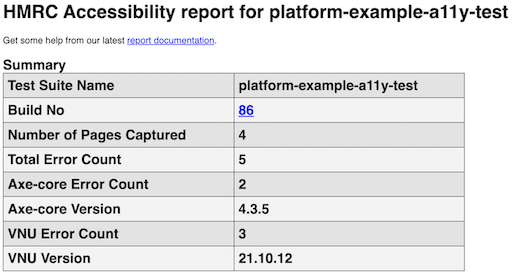
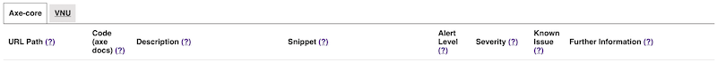
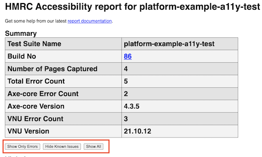

# Understanding the generated accessibility-assessment HTML Report
The AccessibilityTestJobBuilder captures the pages accessed during the test run and runs an assessment using the tools [Axe-core](https://github.com/dequelabs/axe-core) and [VNU](https://www.npmjs.com/package/vnu-jar). The results from the assessment are made available as an HTML report for teams to review.

# Report Summary
The first part of the generated HTML report is the summary. The summary displays at a high level some information on the job that ran, versions of the tools used to run the assessment, the number of pages run against and the number of errors found. Errors, in this case, are potential accessibility issues discovered as part of the assessment.

`Test Suite Name` - The name of the job that was defined within build-jobs implementing the AccessibilityTestJobBuilder.

`Build No` - A number to be able to uniquely identify each build job run as well as display how many times Jenkins has run this job.

`Total Error Count` - The total number of errors raised by both Axe-core and VNU during the assessment. This includes known issues identified by the Platform.

`Axe-core Error Count` - The number of errors raised by Axe-core. This includes known issues identified by the Platform

`Axe-core Version` - The version of Axe-core used to carry out the assessment. If you are looking to reproduce an issue manually using a browser plugin, ensure the axe-core version used by the plugin matches this version used by the job builder.

`Axe-core Page Count` - The number of pages Axe-core ran against.

`VNU Error Count` - The number of errors raised by VNU. This includes known issues identified by the Platform

`VNU Version` - The version of VNU used to carry out the assessment. If you are looking to reproduce an issue manually using a local VNU installation, ensure the local VNU version matches this version used by the job builder.

`VNU Page Count` - The number of pages VNU ran against.

# Report columns
The violations raised from Axe-core and VNU are made available under two different tabs within the generated HTML report.

Each tab displays a number of different columns within the issues table. The following section aims to help teams to understand what each of the columns displayed refers to in order to be able to use the information displayed to resolve the issues raised.

## URL Path
The URL Path of the page that was assessed. This links to the page that was captured during the assessment.

## Code (axe docs)
This column is specific to Axe-core and so is only displayed when the `Axe-core` tab is currently selected.

The text displayed within this column is the identifier that axe-core uses to differentiate between each of the accessibility violations it finds. The link navigates to dequeuniversity.com that displays further information about the violation as well as information on how to potentially fix it.

## Description
The description field includes the description of the violation as described by Axe-core and VNU.

Since these descriptions are provided by the tools themselves and do not include page-specific information, searching the internet or within the organisation with this description can provide useful resources to understand more about the violation and identify a fix.

## Snippet
The snippet of code where the violation has been reported.

The snippet can be used to find and inspect a page's markup to see why there might be an issue and investigate.

When viewing the page that was assessed users can inspect the page and search for the snippet. Users can go to the page using the [URL Path](#URL-Path), or by going to a particular job run and then viewing a page captured within the ‘pages’ directory within the jobs ‘Build Artifacts’.

**Note**: Occasionally, the violation reported for a snippet requires the context of the surrounding elements. So always inspect the captured page and look for the snippet that surfaced in the report to understand the violation better.

## Alert Level
Axe-core and VNU surface three types of alert levels; info, warning, and error.

`info` - issue might not require action from teams.

`warning` - teams should look at this issue to see if there is any action for them to take.

`error` - teams should look to address this issue.

**Note:** Axe-core and VNU can report a total of seven different alert levels. To make this simpler for teams to understand what action they should take, [custom mapping was introduced](https://github.com/hmrc/page-accessibility-check/blob/main/src/main/scala/uk/gov/hmrc/a11y/tools/AlertLevel.scala#L10-L18). As a result of this custom mapping, only three types of alert levels are surfaced within this column rather than seven.

## Severity
This is the severity level that is returned by each of the tools.

We will be reviewing this column in the future and working with the DIAS team to see if it adds any value and if so whether there should be an option to be able to sort by this. As of now, teams don’t have to rely on this column for analysing the violations.

## Known Issue
The Known Issue column indicates whether or not the issue raised within the generated report is a known issue on the platform. The DIAS team advises PLATUI when a violation should be marked as a known issue, these then get surfaced on a report when a known issue is identified.

When an issue is marked as a `Known Issue` further information is also provided. See the [further information](#Further-Information) section for more details about ‘Further Information’. Most known issues cannot be addressed as they relate to for example [govuk-frontend](https://github.com/hmrc/page-accessibility-check/blob/main/src/main/resources/application.conf#L86-L94) and so are outside of a team’s control.

There are however **some known issues that can be resolved** by teams and so, known issues should be looked at to reduce the noise within the report.

## Further Information
The further information column aims to give teams additional context to help them understand why the issue was raised and to help determine whether this issue is something that could be addressed or not.

This column will sometimes link to raised issues with libraries as well as advise teams on particular versions of libraries to upgrade from.

# How to analyse the report
The generated HTML accessibility report can be quite noisy with lots of information being displayed. A good way to approach addressing the raised issues can be to first look to address any errors that are not known issues. To do this, teams can use the provided filters to ‘Show Only Errors’ and ‘Hide Known Issues’ which will reduce lots of the noise.

Teams should work together to look at each reported issue. If you are unsure of an issue raised within the report, reach out to the #community-accessibility channel sharing as much information that is relevant to the issue you are trying to resolve and also link to your report within Jenkins.

Once any errors that are not known issues have been addressed, teams should then ensure that they look through the known issues. Whilst most known issues relate to things that might be outside of your team’s control, this isn’t always the case. Sometimes some of the known issues might be able to be resolved by your team for example by updating to a newer version of a library.

# Need more help?
If you require further information on understanding the generated HTML report or the issues that surfaced within it, please reach out within #community-accessibility.
